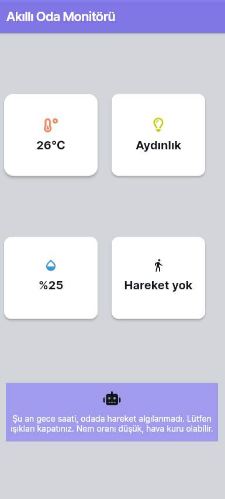

# 🏠 Smart Room Monitor

An IoT-based smart room monitoring and recommendation system developed as an academic design project.

The system collects real-time environmental data using a **Raspberry Pi Pico W** and multiple sensors, sends the measurements to a **Spring Boot REST API**, stores historical data in **PostgreSQL**, and generates context-aware recommendations using a **Python rule-based recommendation engine**.

Current room conditions and generated recommendations are synchronized with **Firebase Firestore** and displayed through a mobile interface developed with **FlutterFlow**.

---

## 📌 Project Overview

Smart Room Monitor was designed to monitor indoor environmental conditions and provide useful recommendations based on sensor readings, time of day, room occupancy, and weather information.

The system monitors:

- 🌡️ Temperature
- 💧 Humidity
- 💡 Ambient light level
- 🚶 Motion / room occupancy

Based on these measurements, the recommendation engine can produce messages such as:

> "No motion was detected in the room, but the lights are on. They can be turned off to save energy."

or:

> "The humidity level is high. Ventilation is recommended."

The main goal of the project is not only to collect sensor data, but also to interpret it and provide context-aware suggestions for **comfort and energy efficiency**.

---

## ✨ Key Features

- Real-time environmental monitoring
- Raspberry Pi Pico W based sensor acquisition
- Temperature and humidity measurement using DHT11
- Motion detection using PIR sensor
- Ambient light measurement using LDR
- Spring Boot REST API
- PostgreSQL data persistence
- Firebase Firestore integration
- Mobile monitoring interface
- OpenWeather API integration
- Time-aware recommendation generation
- Weather-aware recommendations
- Historical sensor data storage
- Periodic monitoring and recommendation updates

---

## 🏗️ System Architecture

The project consists of four main layers:

1. **IoT Sensor Layer**
2. **Backend and Database Layer**
3. **Recommendation Layer**
4. **Cloud and Mobile Visualization Layer**

### Simplified Architecture

```text
        ┌─────────────────────────┐
        │      Room Sensors       │
        │                         │
        │  DHT11   PIR    LDR     │
        └────────────┬────────────┘
                     │
                     ▼
        ┌─────────────────────────┐
        │   Raspberry Pi Pico W   │
        │      MicroPython        │
        └────────────┬────────────┘
                     │
                     │ HTTP / JSON
                     ▼
        ┌─────────────────────────┐
        │   Spring Boot REST API  │
        │        Java 21          │
        └────────────┬────────────┘
                     │
              ┌──────┴──────┐
              │             │
              ▼             ▼
      ┌──────────────┐  ┌───────────────┐
      │ PostgreSQL   │  │ OpenWeather   │
      │ Historical   │  │ Forecast API  │
      │ Sensor Data  │  └───────┬───────┘
      └──────┬───────┘          │
             │                  │
             └────────┬─────────┘
                      ▼
        ┌─────────────────────────┐
        │ Python Recommendation   │
        │         Engine          │
        └────────────┬────────────┘
                     │
                     ▼
        ┌─────────────────────────┐
        │   Firebase Firestore    │
        └────────────┬────────────┘
                     │
                     ▼
        ┌─────────────────────────┐
        │ FlutterFlow Mobile UI   │
        └─────────────────────────┘
```

The Pico W sensor client can also update selected room measurements in Firestore. The Python application combines sensor information obtained through the backend with weather data and writes the generated recommendation to Firestore for visualization.

---

## 🔄 How It Works

The complete data flow can be summarized as follows:

1. The **Raspberry Pi Pico W** reads temperature, humidity, light, and motion sensors.
2. Sensor measurements are converted into JSON data.
3. The Pico W sends the measurements to the **Spring Boot REST API**.
4. The backend processes and stores the measurements in **PostgreSQL**.
5. The Python application retrieves the latest room data from the backend.
6. Weather information is obtained through the backend's **OpenWeather API integration**.
7. The recommendation engine evaluates:
   - temperature
   - humidity
   - ambient brightness
   - motion
   - time of day
   - next-day weather information
8. A context-aware recommendation is generated.
9. Current room information and the recommendation are written to **Firebase Firestore**.
10. The mobile interface displays the latest room status and recommendation.

The monitoring cycle is configured to run periodically, with a default interval of approximately **10 seconds**.

---

## 🛠️ Technology Stack

### Backend

- Java 21
- Spring Boot 3.5.6
- Spring Web
- Spring Data JPA
- Hibernate
- ModelMapper
- Lombok
- Maven

### Database

- PostgreSQL

### IoT / Embedded

- Raspberry Pi Pico W
- MicroPython
- DHT11
- PIR Motion Sensor
- LDR Light Sensor

### Recommendation Module

- Python
- Requests
- Firebase Admin SDK
- Rule-based decision logic

### Cloud & External Services

- Firebase Firestore
- OpenWeather API

### Mobile Interface

- FlutterFlow

---

## 📂 Project Structure

```text
smart-room-monitor/
│
├── smart-room-monitor/
│   ├── src/
│   │   ├── main/
│   │   │   ├── java/com/smartroom/
│   │   │   │   ├── configuration/
│   │   │   │   ├── controller/
│   │   │   │   ├── dto/
│   │   │   │   │   ├── request/
│   │   │   │   │   └── response/
│   │   │   │   ├── entity/
│   │   │   │   ├── repository/
│   │   │   │   ├── service/
│   │   │   │   │   └── impl/
│   │   │   │   └── SmartRoomMonitorApplication.java
│   │   │   │
│   │   │   └── resources/
│   │   │       └── application.yml
│   │   │
│   │   └── test/
│   │
│   └── pom.xml
│
├── room-monitor-python/
│   ├── main.py
│   ├── smart_room_ai.py
│   ├── pico_sensor_client.py
│   ├── anahtar.py
│   └── .gitignore
│
├── .gitignore
└── README.md
```

> `firebase-service-account.json` is intentionally excluded from the repository because it contains private Firebase credentials.

---

# ☕ Spring Boot Backend

The backend provides REST endpoints for room management, user management, sensor data collection, historical sensor data retrieval, and weather information.

The application follows a layered architecture:

```text
Controller
    ↓
Service
    ↓
Repository
    ↓
Database
```

DTO objects are used to separate API request/response models from database entities.

---

## 🌐 REST API Endpoints

### Room Management

| Method | Endpoint | Description |
|---|---|---|
| POST | `/api/smart-room-monitor/room/create` | Create a room |
| GET | `/api/smart-room-monitor/room/getall` | Get all rooms |
| GET | `/api/smart-room-monitor/room/{id}` | Get room by ID |
| PUT | `/api/smart-room-monitor/room/update/{id}` | Update a room |
| DELETE | `/api/smart-room-monitor/room/delete/{id}` | Delete a room |

### Sensor Data

| Method | Endpoint | Description |
|---|---|---|
| POST | `/api/smart-room-monitor/sensor-data` | Submit sensor measurements |
| GET | `/api/smart-room-monitor/sensor-data/room/{roomId}/latest` | Get latest room measurements |
| GET | `/api/smart-room-monitor/sensor-data/room/{roomId}/history` | Get historical measurements |

### User Management

| Method | Endpoint | Description |
|---|---|---|
| POST | `/api/smart-room-monitor/users/create` | Create a user |
| GET | `/api/smart-room-monitor/users/getall` | Get all users |
| GET | `/api/smart-room-monitor/users/{id}` | Get user by ID |
| PUT | `/api/smart-room-monitor/users/update/{id}` | Update a user |
| DELETE | `/api/smart-room-monitor/users/delete/{id}` | Delete a user |

### Weather

| Method | Endpoint | Description |
|---|---|---|
| GET | `/api/weather/tomorrow` | Get next-day temperature information |

---

# 🌡️ IoT Sensor Layer

The Raspberry Pi Pico W acts as the sensor acquisition device.

The current implementation uses:

| Sensor | Purpose |
|---|---|
| DHT11 | Temperature and humidity |
| PIR | Motion / occupancy detection |
| LDR | Ambient light measurement |

The Pico W periodically reads these sensors and constructs a JSON request similar to:

```json
{
  "lightLevel": 15000,
  "motion": true,
  "roomId": 1,
  "temperature": 26,
  "humidity": 45
}
```

The data is then sent to the Spring Boot backend.

---

# 🧠 Rule-Based Recommendation Engine

The project includes a Python-based recommendation module implemented in:

```text
room-monitor-python/smart_room_ai.py
```

Despite the module name, the current implementation does **not use a trained machine-learning model**.

Instead, it uses a deterministic **rule-based decision system**.

This approach was selected because the system works with a limited number of environmental variables and clearly defined conditions. It also makes the recommendations transparent and easy to evaluate.

The engine considers:

```text
Temperature
Humidity
Light level
Motion
Time of day
Weather forecast
```

---

## 🕒 Time-Aware Decisions

The day is divided into four periods:

```text
06:00 - 11:59 → Morning
12:00 - 17:59 → Day
18:00 - 22:59 → Evening
23:00 - 05:59 → Night
```

Different recommendations can therefore be generated for the same sensor values depending on the current time.

For example, detecting a dark room with motion during the day may produce a lighting recommendation, while detecting lights in an unoccupied room at night may produce an energy-saving recommendation.

---

## 💡 Light and Motion Rules

The LDR measurement is converted into an approximate brightness percentage.

Because the sensor operates inversely:

```text
Higher sensor value → darker environment
Lower sensor value  → brighter environment
```

The system converts the raw measurement using:

```text
brightness = 100 - (lightLevel / 63695 × 100)
```

Example rules include:

```text
Night + light on + no motion
→ Recommend turning the lights off.

Night + dark environment + motion
→ Recommend turning the lights on.

Day + dark environment + motion
→ Recommend increasing lighting.

Day + bright environment + no motion
→ Recommend turning unnecessary lighting off.
```

---

## 🌡️ Temperature Rules

Current temperature rules include:

```text
Temperature < 20°C
→ "Room temperature is low. Heating can be increased."

Temperature > 28°C
→ "Room temperature is high. Cooling can be enabled."
```

---

## 💧 Humidity Rules

```text
Humidity < 30%
→ Air may be too dry.

Humidity > 60%
→ Ventilation is recommended.
```

---

## 🌤️ Weather-Aware Recommendations

The backend integrates with the OpenWeather forecast API.

Weather information can be used by the recommendation engine during the evening.

Examples:

```text
Tomorrow < 10°C
→ Suggest preparing for a colder environment.

Tomorrow > 30°C
→ Suggest reviewing cooling settings.
```

This allows the system to make recommendations based not only on current room conditions but also on upcoming environmental conditions.

---

## 🌿 Stable Room Conditions

When none of the rules require an action, the system generates a time-dependent status message.

Examples include:

```text
Morning:
"Everything looks stable. Have a nice morning."

Day:
"Room conditions are ideal."

Evening:
"Everything looks good. Have a pleasant evening."

Night:
"Room conditions are stable. Good night."
```

---

# 🔥 Firebase Integration

Firebase Firestore is used as the cloud synchronization layer for the visualization interface.

The system stores current room information such as:

```text
sicaklik
nem
isik
hareket
ai_notu
```

where `ai_notu` contains the recommendation generated by the Python decision engine.

This allows the visualization layer to access the latest room status without directly accessing the PostgreSQL database.

### Security Note

Firebase service-account credentials are **not stored in this repository**.

The following file is ignored:

```text
firebase-service-account.json
```

A Firebase service account must be configured locally before running the Firebase integration.

---

# 📱 Mobile Monitoring Interface

A simple mobile monitoring interface was created using **FlutterFlow**.

The interface displays the current:

- Temperature
- Humidity
- Light status
- Motion status
- Smart room recommendation

Example:

```text
Temperature: 26°C
Light: Bright
Humidity: 25%
Motion: No motion

Recommendation:
It is currently night and no motion was detected.
Please turn off the lights.
The humidity level is low; the air may be dry.
```

The mobile application acts primarily as a **monitoring and visualization interface**, while sensor processing, data persistence, and recommendation generation are handled by the other components of the system.

---

# ⚙️ Configuration

The Spring Boot application expects sensitive configuration values to be supplied through environment variables.

Example:

```yaml
spring:
  datasource:
    url: ${DB_URL:jdbc:postgresql://localhost:5432/smartroom}
    username: ${DB_USERNAME:postgres}
    password: ${DB_PASSWORD}

weather:
  api:
    key: ${OPENWEATHER_API_KEY}
```

Required environment variables:

```text
DB_PASSWORD
OPENWEATHER_API_KEY
```

Optional database configuration:

```text
DB_URL
DB_USERNAME
```

---

## 🔐 Sensitive Files

The repository is configured to exclude local credentials and generated files.

Examples include:

```gitignore
.env
*.env
application-local.yml
application-local.yaml
firebase-service-account.json
*service-account*.json
*firebase-adminsdk*.json
__pycache__/
*.py[cod]
.idea/
.vscode/
target/
```

Never commit:

- Database passwords
- Wi-Fi passwords
- OpenWeather API keys
- Firebase private keys
- Firebase service-account JSON files

---

# 🚀 Running the Project

Because this project contains multiple components, they must be configured separately.

## 1. PostgreSQL

Create a PostgreSQL database:

```text
smartroom
```

Configure the database credentials using environment variables.

Example in PowerShell:

```powershell
$env:DB_USERNAME="postgres"
$env:DB_PASSWORD="your_database_password"
$env:OPENWEATHER_API_KEY="your_openweather_api_key"
```

---

## 2. Start the Spring Boot Backend

Navigate to the backend directory:

```bash
cd smart-room-monitor
```

On Windows:

```powershell
.\mvnw.cmd spring-boot:run
```

The backend runs by default on:

```text
http://localhost:8080
```

---

## 3. Configure Raspberry Pi Pico W

Before uploading `pico_sensor_client.py` to the Pico W, configure:

```python
WIFI_SSID = "YOUR_WIFI_SSID"
WIFI_PASSWORD = "YOUR_WIFI_PASSWORD"

LOCAL_API_URL = (
    "http://YOUR_BACKEND_HOST:8080/"
    "api/smart-room-monitor/sensor-data"
)
```

`YOUR_BACKEND_HOST` must be replaced with the IP address of the computer running the Spring Boot backend when the Pico W and backend are on the same network.

---

## 4. Configure Firebase

Create or use a Firebase project with Firestore enabled.

Download a Firebase service-account credential and store it locally as:

```text
room-monitor-python/firebase-service-account.json
```

Do **not** commit this file to Git.

---

## 5. Install Python Dependencies

The desktop-side Python module requires packages such as:

```bash
pip install firebase-admin requests pyserial
```

---

## 6. Start the Recommendation Module

Navigate to:

```bash
cd room-monitor-python
```

Then run:

```bash
python main.py
```

The program periodically retrieves the latest sensor and weather information, evaluates the room conditions, generates recommendations, and updates Firestore.

---

# 🧪 Example Scenarios

### Scenario 1 — Empty Room With Lights On

```text
Time: Night
Motion: False
Room: Bright
```

Recommendation:

```text
No motion was detected in the room.
The lights should be turned off to save energy.
```

### Scenario 2 — Occupied but Dark Room

```text
Time: Day
Motion: True
Room: Dark
```

Recommendation:

```text
Motion was detected, but the room is dark.
Lighting can be increased.
```

### Scenario 3 — High Humidity

```text
Humidity: 70%
```

Recommendation:

```text
Humidity is high.
Ventilation is recommended.
```

### Scenario 4 — High Temperature

```text
Temperature: 31°C
```

Recommendation:

```text
Room temperature is high.
Cooling can be enabled.
```

### Scenario 5 — Normal Conditions

If no rule is triggered:

```text
Room conditions are stable.
```

---

# 📊 Experimental Evaluation

During the project, different combinations of temperature, humidity, light, motion, time, and weather conditions were tested to evaluate the recommendation logic.

The system was evaluated using **20 different scenarios**, with **19 scenarios producing the expected recommendation**.

The prototype therefore achieved approximately:

```text
19 / 20 = 95%
```

agreement with the expected decisions in the defined test scenarios.

This value represents the success rate of the predefined rule-based test scenarios and should **not** be interpreted as machine-learning model accuracy.

Sensor measurements were sampled approximately every **10 seconds**, and the prototype demonstrated approximately **1 second end-to-end delay** between data generation and its appearance in the monitoring interface under the tested conditions.

---

# ⚠️ Limitations

The current implementation is a prototype developed for an academic design project.

Some limitations include:

- Recommendation logic is rule-based rather than machine-learning based.
- Threshold values are manually defined.
- The current prototype focuses primarily on a single-room scenario.
- Firebase and PostgreSQL are both used for different parts of the prototype data flow.
- Some hardware/network configuration values must be configured manually.
- The mobile interface focuses on monitoring rather than advanced room control.
- Authentication and production-level API security are outside the current prototype scope.

---

# 🔮 Future Improvements

Possible future improvements include:

- Multi-room support
- Machine-learning-based anomaly detection
- Adaptive recommendation thresholds
- Historical data visualization
- Energy consumption estimation
- Push notifications
- Automatic HVAC control
- Automatic lighting control
- User authentication and authorization
- Docker-based deployment
- Improved API security
- Sensor calibration
- Mobile application expansion
- Long-term environmental trend analysis

---

# 🎓 Academic Context

This project was developed as part of the **Computer Engineering Design Study (Tasarım Çalışması)** at **Bilecik Şeyh Edebali University**.

The project demonstrates the integration of several areas of computer engineering:

- Internet of Things
- Embedded systems
- Backend development
- REST API design
- Database systems
- Cloud services
- Mobile visualization
- External API integration
- Rule-based decision systems

The primary objective was to build an end-to-end prototype in which physical sensor measurements could be collected, processed, stored, interpreted, and presented to the user through a monitoring interface.

---

## 👩‍💻 Author

**Selin Zehra Bölükbaş**  
Computer Engineering  
Bilecik Seyh Edebali University

---

## 📄 License

This project was developed primarily for academic and educational purposes.

<p align="center">
  
</p>
